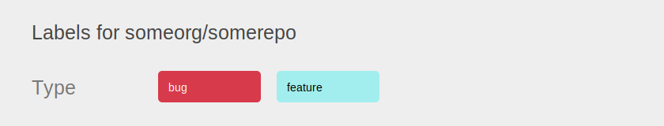
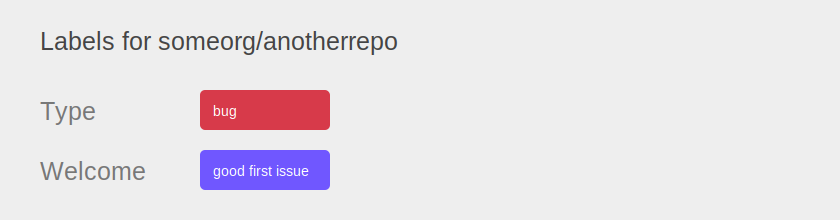
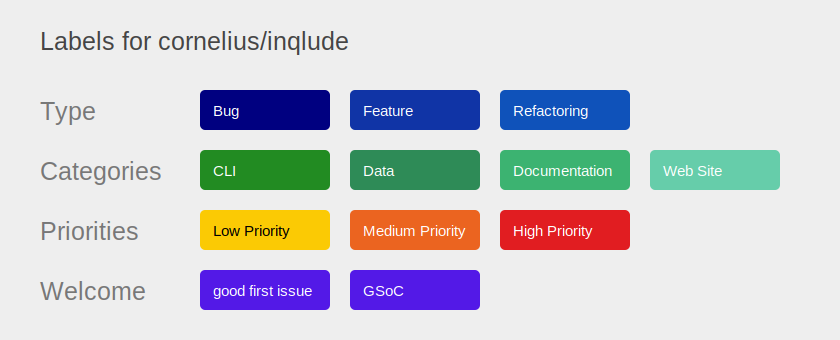

# Beautiful Labels

GitHub labels are powerful but it's a bit of an effort to manage them consistently, especially when you have many of them or you want to manage them consistently across multiple repositories. `beautiful-labels` is a tool to help with that.

It takes a YAML description of the labels and then applies that to the configuration on GitHub via the API. It uses Terraform to manage the state on GitHub which gives you all the nice features of Terraform to manage infrastructure as code.

The YAML description can contain label definitions for multiple repositories belonging to the same organization. Using YAML features such as anchors and references it's possible to share definitions between repositories without repeating them. So you can define common labels in one place and can change shared descriptions or colors for multiple labels by changing only one definition.

You can check in the YAML description of your labels to your git repository and then handle it as you would handle code with version history, pull requests, diffs, etc. Managing descriptions or colors becomes as simple as editing a text file.

*Please notice: This is early code so use it with care. Especially renaming labels can be a bit tricky as GitHub uses the name of the label as identifier. I would recommend to do the renaming in the GitHub UI and then update the YAML file accordingly manually for now.*


## How to use `beautiful-labels`

The general workflow is as follows:

1) Scan labels from the GitHub repo do get an initial YAML description:

        beautiful-labels scan <org> <repo> --output-file=<config-file>

   You are free to use any output file you want. One option is to put it into a `.github/labels` directory, so you can manage the data in git as part of your repository.

2) Edit YAML and adapt it to your needs. Add categories as needed. The categories are not handled by the GitHub label functionality but can help to structure labels and group them, for example by using colors.

3) Create an SVG overview of your labels:

        beautiful-labels create-svg <config-file> <repo> --output-file=<svg-file>

   This reads the YAML file and generates an SVG with an overview of your labels for the given repository. You can link that from your contribution documentation, for example.

4) Create the Terraform configuration:

        beautiful-labels write-config <config-file>  --output-file=<terraform-config>

   This generates the configuration required by Terraform to operate the GitHub API. You might want to check in the configuration and possibly the Terraform state file as well depending on how you run it. If in doubt you probably don't want to check it in.

5) Run Terraform

   Install Terraform with the package manager of your system or download it from the [Terraform download page](https://www.terraform.io/downloads.html). Then run 'terraform init' to prepare Terraform and install the required GitHub provider.

   Terraform needs a GitHub token to do changes via the API. Generate one in the GitHub API and provide it to Terraform, e.g. by setting the environment variable `TF_VAR_github_token`.

   Run `terraform apply` to apply your changes to your project on GitHub. You will get an overview of what will be changed and need to confirm it. For a dry run use `terraform plan`. It tells you what it would do without doing any changes.

### Backing up label assignments

It's possible to save a backup of label assignments for a given repository to a JSON file by running

    beautiful-labels save-backup <config-file> <repo> <output-directory>

This writes a timestamped file to the given output directory containing the information about which issues and pull requests have which labels assigned. This can be useful as a safety measure before doing massive label changes. Note that beautiful-labels currently doesn't have an automated command to restore labels from this backup.

### Showing label configuration

You can display the parsed configuration with the command

    beautiful-labels show <config-file>

This parses and resolves the YAML and shows the configuration as text output in a human-readable form.

You can use this command to check that your configuration file is well-formed and contains the correct information.


## YAML description

### Simple example

This is a simple example for labels of one repo. It defines two labels and their colors and descriptions.

The `id` entry is used in the Terraform configuration to identify the label objects managed there. They are, for example, shown, in the output of `terraform apply`.

```yaml
org: someorg
repo: somerepo
categories:
  - name: All
    labels:
    - name: bug
      description: Bug reports
      color: d73a4a
      id: bug
    - name: feature
      description: Feature requests
      color: a2eeef
      id: feature
```

These are the generated labels:


### Multi-repo example

This is an example for a configuration for multiple repos. The label configuration is provided as a list of objects with the `repos` key.

The example creates two labels for two repositories. The `bug` label is defined as a shared description in both repositories by using a YAML anchor and references to that. The other labels are defined for their specific repositories.

The first repo has all labels in one category `Type`, while the second repo has a second category `Welcome` for the `good first issue` label. This makes more sense if you have more labels.

```yaml
shared: &label_bug
  name: bug
  description: Something isn't working
  color: d73a4a
  id: bug
org: someorg
repos:
- repo: somerepo
  categories:
  - name: Type
    labels:
    - *label_bug
    - name: feature
      description: New feature
      color: a2eeef
      id: enhancement
- repo: anotherrepo
  categories:
  - name: Type
    labels:
    - *label_bug
  - name: Welcome
    labels:
    - name: good first issue
      description: Good for newcomers
      color: 7057ff
      id: good_first_issue
```

These are the generated labels:





### Terraform remote state

You can also use the Terraform cloud to store the state. This makes it possible to run Terraform on different machines or by different people and share the state so that only the necessary changes are done via the API. See the [Terraform documentation](https://www.terraform.io/docs/enterprise/free/index.html) for more information how to set this up and use it.

The required configuration is generated, if you add a remote state section in the YAML configuration such as:

```yaml
remote_state:
  org: someterraformorg
  workspace: someworkspace
```

If the `workspace` entry is left out a default name `beautiful-labels` is used.

### Colors

You can specify colors per label in the configuration by providing an entry of the form `color: rrggbb` where `rrggbb` is the hex code of the color in the label part of the configuration.

You can also specify a color per category which is used for all labels in the category by providing the the `color` entry not on the label level but on the category level.

There is a special kind of color value recognized on the category level to specify not the same color for all labels but a range which is then automatically calculated for all labels in the category. This results in the labels of a category using something like a gradient for their colors so that they can be distinguished by the color but still adhere to the same base color. All range values start with `range-`. Valid values are `range-blue`, `range-green`, `range-red`, `range-pink`, `range-grey`. There also is the special range `range-rainbow` (you can guess what that does).


## Real-world example

Here is an example of labels managed through `beautiful-labels` from the [inqlude](https://github.com/cornelius/inqlude) repository:



See the [YAML configuration](https://github.com/cornelius/inqlude/blob/master/.github/labels/cornelius-inqlude-labels.yaml) for the definition of these labels.


## License

`beautiful-labels` is licensed under the MIT license.
